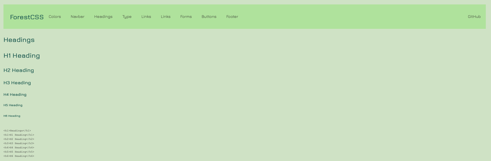

# ForestCSS Framework

## What is ForestCSS?



ForestCSS is a CSS framework designed to "forestify" and provide a base foundation for styling any HTML web page. ForestCSS was designed to provide a calming, earthy, and forest theme to any web page.

## How can I use ForestCSS?

Download the `forest.css` file from this repo and simply link it to your HTML document!

```
<link rel="stylesheet" type="text/css" href="forest.css" />
```
